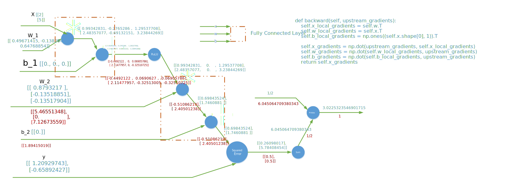

## 一个自主实现的神经网络框架
出于掌握神经网络的 Forward/Backward Propagation、Chain Rule for computing the derivative 的学习性目的，搭建了此框架，给出了常见神经网络 operation 的 forward 和 backward 方法。
由于是用于学习目的，代码的封装性不足，计算图构建繁琐，“Learning in the hard way”。

#### initializer
1. zero_initializer
2. xavier_initializer

#### Operations
1. FullyConnected
2. ReLU
3. Sigmoid
4. SquaredError
5. Sum
6. Multiply
7. SoftMax

###### 神经网络正确性的验证
在*神经网络正确性的验证.ipynb*中通过对比*基于自主实现的神经网络框架搭建的神经网络*和*基于TensorFlow 搭建的神经网络*的前向传播和反向传播的结果，对自主实现的神经网络框架的正确性进行了验证。

###### 一个计算图的例子
